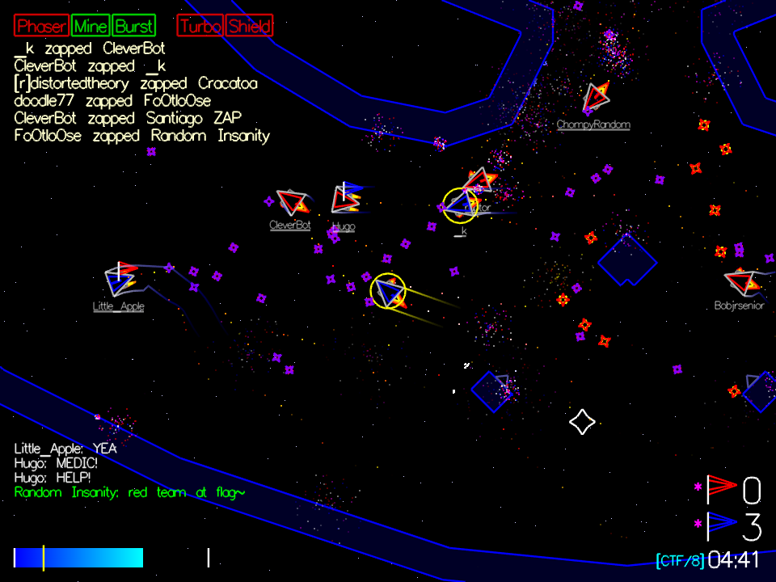

# BITFIGHTER

The fast-paced team-based outer-space multi-player arcade game. Blast your friends, zap your enemies. Steal their flags and nuke their cores. Customize your ship to be sneaky, or overwhelm with superior firepower. It's fast, fun, and frenetic.

## [Download](http://bitfighter.org/downloads/) | [Join Discord](https://discord.gg/3sdzjkz) | [Visit the Wiki](http://bitfighter.org/wiki/index.php?title=Main_Page) 

## DEPENDENCIES

Bitfighter has several common, open source dependencies:
* SDL2
* zlib
* libpng
* openal
* libvorbis
* libspeex
* libmodplug

These dependencies are provided for you on Windows and macOS.

On Linux, you must install them using your distribution's preferred method. On Ubuntu, for instance, you need to run `sudo apt-get install cmake libphysfs-dev libsdl2-dev libopenal-dev libvorbis-dev libmodplug-dev libspeex-dev`.

## COMPILING

The CMake build system is used for compiling on Windows, macOS and Linux. You will need to download and install CMake 3.1+ for these platforms.

[We have additional information on our wiki.](https://bitfighter.org/wiki/index.php/Building_Bitfighter)

### Linux

You will need the development headers of the above dependencies installed as well as the following software to compile:
* cmake
* make
* gcc / g++

Open a terminal at the base of this repository.  Then run the following commands:

1. `cd build/`
2. `cmake ..`
3. `make`

To set up a debugging build do:  `cmake -DCMAKE_BUILD_TYPE=Debug ..`

To build a dedicated server do: `make bitfighterd`

### Windows

Bitfighter can be built with at least the following build systems:
  * Visual Studio
  * MingW/MSYS

To generate the proper project files with CMake, open a command prompt and `cd` into this repository's `build` directory. Then type ONE of the following:
* `cmake -G "Visual Studio 15 2017" ..`
* `cmake -G "Visual Studio 15 2017" -T "v141_xp" ..`
* `cmake -G "MSYS Makefiles" ..`

To see a list of generators for CMake, see here:

http://www.cmake.org/cmake/help/v2.8.11/cmake.html#section_Generators

Different versions of Visual Studio are known to work, but you need to use the
correct generator with CMake.

#### Microsoft Visual Studio:
Start Visual Studio.  Select Open Project, then navigate to the `build` folder, and open the bitfighter solution file.

Right-click on the `bitfighter` target and select `build` to compile the game. This will take a few minutes the first time.

To run, click Debug > Start Debugging (or press F5).

#### MinGW / MSYS
After generating the MSYS makefiles, all you have to do is run `make` to compile

### macOS (10.7+)

Similar to Linux, but with some additional steps.  In a shell, in the `build` directory, run:
* `export MACOSX_DEPLOYMENT_TARGET=10.7`
* `cmake ..`
* `make Bitfighter`

## INSTALLATION AND PACKAGING
### Linux
After running `make`, the bitfighter executable is put into the directory `exe/`.  Copy everything from the `resources/` directory into the `exe/` directory, keeping the folders intact (like sfx, scripts, etc.).

Bitfighter can now be run from the `exe/` folder with no changes to your system.

Alternatively, you can do a full install directly into your system with `sudo make install`.

For distribution packaging, Bitfighter is built using the Open Build Service at: https://build.opensuse.org/package/show/games/bitfighter

### Windows
Run the PACKAGE project in the Visual Studio project.

Alternatively, an NSIS build script is found in the following directory:`build/windows/installer`.

This will build a self-extracting installer for Bitfighter. You will need to build in `Release` mode as the installer is looking for an executable named `bitfighter.exe`.

### macOS
Run `make package` to build a distributable DMG.

## CRASHES & PROBLEMS
If you are building off of the `master` branch, then expect crashes and problems. Feel free to report them via the Issues tab, but consider joining the Discord and checking in the dev_irc channel to ask a developer about it- we probably are already aware.

If you are building off of a release version, please make sure you can consistently reproduce the problem, then post it, with the steps to reproduce, on the Issues tab.
